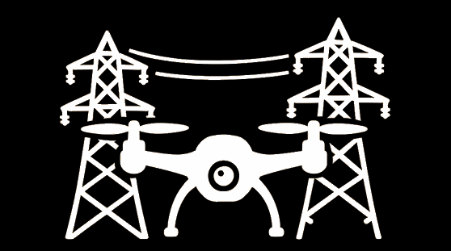

# PowerLineDrone



**Sistema Integrado de Orientação e Navegação para Captura e Controlo de Infraestruturas Elétricas**

PowerLineDrone é uma aplicação Android que revoluciona a inspeção de linhas de transmissão elétrica, fornecendo controlo autónomo de voo de drones e aquisição automatizada de imagens para análise de infraestruturas.

## Visão Geral do Projeto

A manutenção de infraestruturas de transmissão elétrica tradicionalmente depende de inspeções manuais que envolvem elevados custos operacionais, riscos de segurança e baixa eficiência. O PowerLineDrone aborda estes desafios permitindo missões totalmente autónomas com drones para inspeção de linhas elétricas com posicionamento preciso e captura de imagem padronizada.

Desenvolvido em parceria com a EDP e o Laboratório Labelec, esta solução permite às empresas de serviços elétricos:
- Reduzir custos de inspeção
- Melhorar a segurança dos trabalhadores
- Recolher dados visuais padronizados e de alta qualidade
- Identificar problemas de infraestrutura precocemente
- Otimizar rotas de inspeção

## Características Principais

### Planeamento e Execução de Missões
- **Importação de Estruturas**: Carregamento de coordenadas de estruturas a partir de ficheiros CSV
- **Importação de Posições de Fotografia**: Definição de posições de fotografia padronizadas relativas às estruturas
- **Voo Autónomo**: Execução completa da missão sem introdução manual de coordenadas
- **Navegação por Pontos**: Posicionamento preciso para cada ponto de inspeção
- **Revisão de Fotografias**: Revisão em tempo real das imagens capturadas com opções de aceitar/rejeitar

### Interface de Utilizador
- **Layouts Adaptáveis**: Otimizados para orientações vertical e horizontal
- **Estado em Tempo Real**: Progresso da missão e telemetria do drone em direto
- **Controlos de Missão**: Capacidades de iniciar, pausar, retomar e parar
- **Galeria de Fotografias**: Navegar, visualizar, partilhar e gerir imagens capturadas

### Gestão de Media
- **Captura de Fotografias**: Aquisição automatizada de imagens nos pontos de inspeção
- **Modo Manual**: Opção para captura manual de fotografias quando necessário
- **Armazenamento de Imagens**: Armazenamento local com estrutura de ficheiros organizada
- **Revisão de Fotografias**: Diálogos de confirmação para controlo de qualidade imediato

### Telemetria
- **Estado do Drone**: Informações em tempo real sobre conexão, modelo e bateria
- **Dados de Posição**: Coordenadas de localização atual do drone e altitude
- **Progresso da Missão**: Acompanhamento da conclusão de estruturas e fotografias

## Tecnologia

O PowerLineDrone é construído utilizando:
- **Java** para desenvolvimento de aplicações Android
- **DJI Mobile SDK** para comunicação e controlo do drone
- **Android UI Toolkit** para a interface de utilizador
- **Análise CSV** para importação de dados de missão

## Instalação

### Pré-requisitos
- Dispositivo Android a executar Android 6.0 (Marshmallow) ou superior
- Drone DJI compatível com Mobile SDK (séries Mavic, Phantom ou Matrice)
- Aplicação DJI Go 4 instalada (para configuração inicial do drone)

### Configuração
1. Clone o repositório:
   ```
   git clone https://github.com/antoniolox1721/PowerLineDrone.git
   ```

2. Abra o projeto no Android Studio

3. Compile e instale a aplicação no seu dispositivo Android:
   ```
   ./gradlew assembleDebug
   ```
   
4. Em alternativa, descarregue o ficheiro APK da versão mais recente na [página de Lançamentos](https://github.com/antoniolox1721/PowerLineDrone/releases)

## Utilização

### Configuração Inicial
1. Ligue o seu dispositivo Android ao comando do drone DJI
2. Inicie a aplicação PowerLineDrone
3. Aguarde que o estado de ligação do drone mude para "Ligado"

### Planeamento de Missão
1. Toque em "Importar Estruturas" para carregar o seu ficheiro CSV de coordenadas de estruturas
2. Toque em "Importar Posições" para carregar o seu ficheiro CSV de posições de fotografias

### Execução de Missão
1. Toque em "Iniciar Missão" para começar a inspeção automatizada
2. O drone navegará para cada estrutura e capturará fotografias
3. Quando for necessária a revisão de fotografias, confirme ou rejeite a fotografia
4. Utilize Pausa/Retomar para controlar o fluxo da missão conforme necessário
5. Para terminar a missão antecipadamente, toque em "Parar" para retornar à posição inicial

### Galeria de Fotografias
1. Toque em "Galeria" para visualizar todas as imagens capturadas
2. Selecione qualquer fotografia para visualizar em ecrã inteiro
3. Utilize as opções Partilhar ou Eliminar para gerir as suas fotografias

## Formatos de Ficheiros CSV

### CSV de Estruturas
```
latitude,longitude,diferença_de_altitude_base_para_poste,altura_da_estrutura
38.736946,-9.142685,10.5,25.0
38.737012,-9.143998,11.2,28.5
...
```

### CSV de Posições de Fotografias
```
deslocamento_x,deslocamento_y,deslocamento_z,inclinação_gimbal
5.0,0.0,3.0,-30.0
-5.0,0.0,3.0,-30.0
0.0,0.0,5.0,-90.0
...
```

## Equipa do Projeto

Este projeto é desenvolvido por uma equipa do Instituto Superior Técnico em parceria com a EDP:

- **Ricardo Nobre**: Testes e Documentação
- **João Henriques**: Gestão de Câmara e Multimédia
- **Miguel Baia**: Controlo Básico de Voo
- **Henrique Martins**: Interface Básica de Utilizador
- **Luís Almeida**: Pontos de Navegação e Missões
- **António Alves**: Desenvolvimento Avançado de Interface

## Consultores Científicos
- **André Coelho** (EDP)
- **Rui Martins** (EDP)

## Coordenadores do Projeto
- **Luis Caldas de Oliveira** (Coordenador)
- **Rita Cunha** (Mentora)

## Contribuições

Recebemos contribuições para o projeto PowerLineDrone. Sinta-se à vontade para submeter pull requests ou abrir issues para discutir potenciais melhorias.

1. Faça fork do repositório
2. Crie a sua branch de funcionalidade (`git checkout -b funcionalidade/recurso-incrivel`)
3. Confirme as suas alterações (`git commit -m 'Adicionar algum recurso incrível'`)
4. Envie para a branch (`git push origin funcionalidade/recurso-incrivel`)
5. Abra um Pull Request

## Licença

Este projeto está licenciado sob a Licença MIT - consulte o ficheiro [LICENSE](LICENSE) para detalhes.

## Agradecimentos

- EDP por fornecer patrocínio e conhecimentos para o projeto
- Laboratório Labelec pelo apoio técnico
- DJI pelo Mobile SDK que torna possível o controlo de drones

---

*PowerLineDrone - Tornando a inspeção de infraestruturas elétricas mais segura, mais rápida e mais eficiente.*
